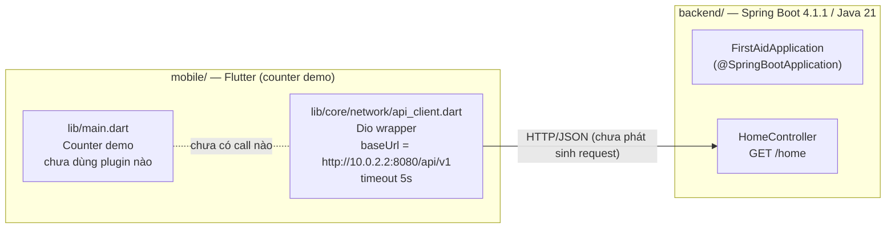
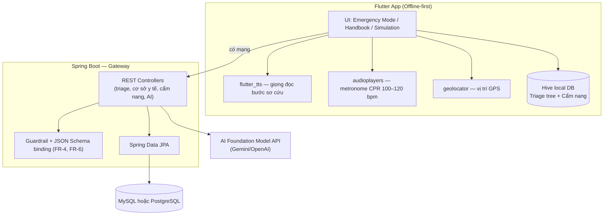
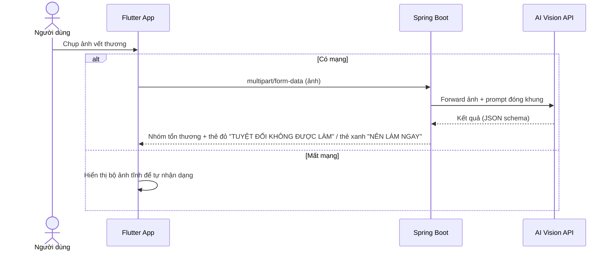
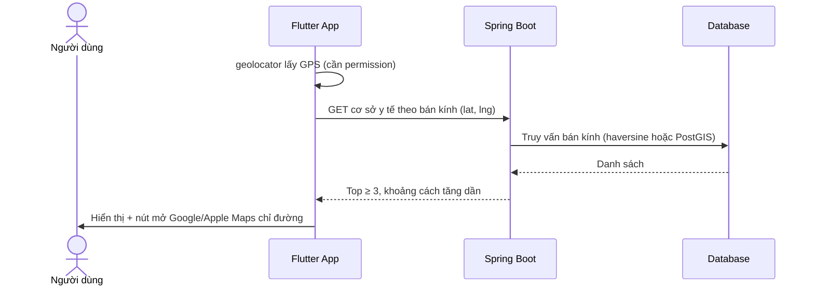
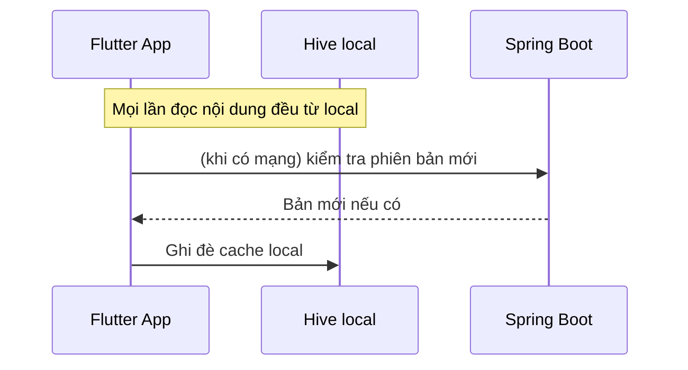
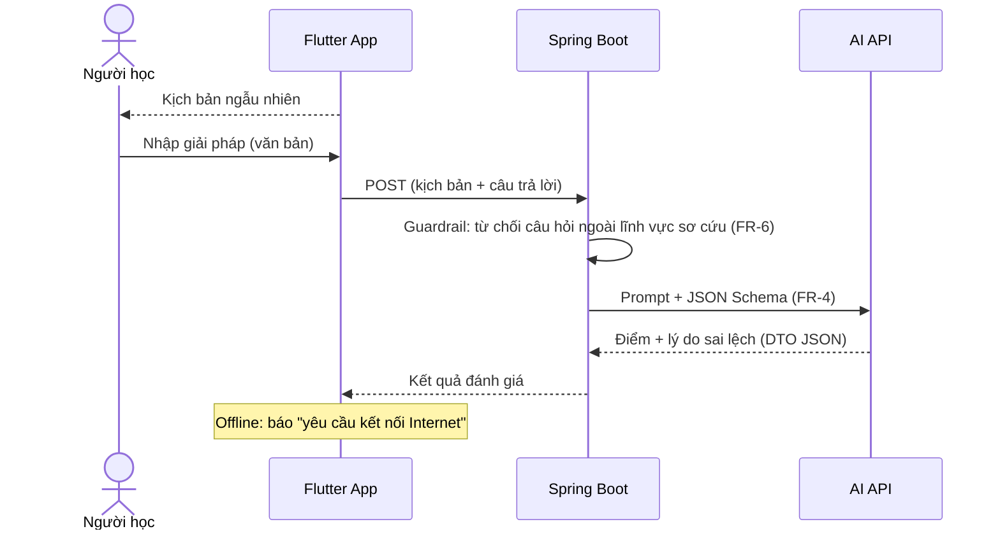

# FirstAid AI — Kiến trúc hệ thống (Architecture Document)

| Thuộc tính | Giá trị |
|---|---|
| **Mã tài liệu** | `ARCH-001` |
| **Phiên bản** | 1.0 |
| **Trạng thái** | Draft — chờ review |
| **Ngày phát hành** | 2026-09-29 |
| **Chủ sở hữu tài liệu** | [NEED DECISION] Nhóm FirstAid (chưa phân công cụ thể) |
| **Nguồn sự thật (Source of Truth)** | Code trong repository `firstaid/` (ưu tiên), sau đó đến `docs/PRD.md` |
| **Phạm vi mô tả** | Kiến trúc **đang tồn tại trong code** + kiến trúc mục tiêu theo PRD, phân biệt rõ |

### Change Log

| Bản | Ngày | Người thay đổi | Mô tả thay đổi |
|---|---|---|---|
| 0.1 | 2026-09-29 | Hoang| Draft đầu tiên |
| 1.0 | 2026-09-29 | Hoang| Tái cấu trúc theo chuẩn tài liệu kiến trúc: thêm Change Log, quy ước nhãn, Decision Log, Conflict Registry, Decision Queue, Glossary |

### Tài liệu tham chiếu

| Mã | Tài liệu | Vị trí |
|---|---|---|
| PRD | FirstAid Product Requirements (v0.1, 2026-09-11) | `docs/PRD.md` |
| README | Hướng dẫn tổng quan dự án | `README.md` |

---

## Quy ước (Conventions)

Mọi nội dung kỹ thuật trong tài liệu được gắn một trong ba nhãn trạng thái:

| Nhãn | Ý nghĩa | Cách kiểm chứng |
|---|---|---|
| **`[HIỆN TẠI]`** | Đã tồn tại trong repository, có đường dẫn file cụ thể kèm theo | Mở file được trỏ tới |
| **`[PLANNED]`** | Có trong PRD/tài liệu phê duyệt nhưng **chưa có trong code** | Tham chiếu US/FR trong PRD |
| **`[NEED DECISION]`** | Chưa đủ thông tin hoặc các nguồn mâu thuẫn; **cấm triển khai khi chưa có quyết định** | Xem Decision Queue (§9.3) và Conflict Registry (§9.1) |

Số hiệu dùng xuyên suốt tài liệu:
- `C-<n>`: mâu thuẫn giữa tài liệu và code (Conflict Registry, §9.1)
- `D-<n>`: quyết định kiến trúc (Decision Log, §9.2)
- `Q-<n>`: vấn đề chờ quyết định (Decision Queue, §9.3)

---

## Mục lục

1. [Tóm tắt điều hành](#1-tóm-tắt-điều-hành)
2. [Tổng quan hệ thống](#2-tổng-quan-hệ-thống)
3. [Công nghệ (Technology Stack)](#3-công-ngệhtechnology-stack)
4. [Kiến trúc cấp cao](#4-kiến-trúc-cấp-cao)
5. [Trách nhiệm thành phần](#5-trách-nhiệm-thành-phần)
6. [Giao tiếp giữa các thành phần](#6-giao-tích-giữa-các-thành-phần)
7. [Luồng dữ liệu các workflow chính](#7-luồng-dữ-liệu-các-workflow-chính)
8. [Tầng chức năng (Layer Responsibilities)](#8-tầng-chức-nănglayer-responsibilities)
9. [Decision Log, Conflict Registry, Decision Queue](#9-decision-log-conflict-registry-decision-queue)
10. [Ranh giới & Ràng buộc kiến trúc](#10-ranh-giới--ràng-buộc-kiến-trúc)
11. [Phụ lục](#11-phụ-lục)

---

## 1. Tóm tắt điều hành

FirstAid AI là hệ thống trợ lý sơ cứu y tế khẩn cấp (Flutter mobile + Spring Boot backend) hướng tới SDG 3 và Đề án cấp cứu ngoại viện tại Việt Nam, với cơ chế **Hybrid Offline-first** (PRD §1).

**Trạng thái kiến trúc hiện tại:** repository đang ở giai đoạn **khung xương (skeleton)**:

- **Mobile**: ứng dụng Flutter vẫn là counter demo mặc định; đã có sẵn 1 lớp hạ tầng HTTP (`ApiClient` – Dio) và đầy đủ khai báo dependencies theo hướng PRD, nhưng chưa có nghiệp vụ nào.
- **Backend**: Spring Boot (v4.1.1, Java 21) với đúng 1 endpoint `GET /home` dạng smoke-test.
- **AI / Database / Service ngoài**: **chưa tồn tại trong code** — toàn bộ là `[PLANNED]`.

> Kết luận cho người đọc: **mọi tính năng trong PRD đều chưa được triển khai.** Tài liệu này ghi lại chính xác "có gì" và "sẽ có gì" để tránh nhầm lẫn khi giao việc cho developer hoặc AI coding agent.

---

## 2. Tổng quan hệ thống

### 2.1 Hai giá trị cốt lõi [PLANNED] (PRD §1)

| Phân hệ | Nội dung | User stories |
|---|---|---|
| **Emergency Mode** | 1 chạm, không đăng nhập → Triage (3 câu hỏi có/không) → phác đồ từng bước bằng giọng nói (TTS) + metronome CPR 100–120 bpm + phân loại vết thương bằng ảnh + bản đồ cơ sở y tế gần nhất | US-001 → US-005 |
| **Handbook & AI Simulation** | Cẩm nang sơ cứu offline + phòng mô phỏng tình huống do AI chấm điểm | US-006, US-007 |

### 2.2 Nguyên tắc vận hành [PLANNED]

- **Hybrid Offline-first** (FR-2): có mạng → gọi backend; mất mạng → fallback local DB trong **< 100ms** cho toàn bộ bước sơ cứu sinh tử (CPR, hóc dị vật, cầm máu).
- **Zero-hallucination** (PRD §2, FR-4): mọi output AI phải đi qua JSON Schema binding vào DTO; không cho AI sinh văn bản tự do ra UI.
- **Tuân thủ phác đồ** 100% Hội Chữ thập đỏ Việt Nam / Bộ Y tế (PRD §2, benchmark 50 ca — PRD §9).

---

## 3. Công nghệ (Technology Stack)

> Nguyên tắc: chỉ liệt kê những gì **có trong file cấu hình**. Cột "Trạng thái" phân biệt đã dùng trong code vs. mới chỉ khai báo.

### 3.1 Mobile client [HIỆN TẠI] — nguồn: `mobile/pubspec.yaml`

| Nhóm | Gói / Công nghệ | Version constraint | Trạng thái |
|---|---|---|---|
| Framework | Flutter (Dart SDK `^3.10.7`) | — | Đang dùng (app demo) |
| State management | `flutter_bloc` | ^8.1.5 | Khai báo, **chưa dùng** |
| Dependency injection | `get_it` | ^7.7.0 | Khai báo, **chưa dùng** |
| HTTP client | `dio` | ^5.4.3+1 | Dùng trong `lib/core/network/api_client.dart` |
| TTS | `flutter_tts` | ^4.0.2 | Khai báo, **chưa dùng** (US-003) |
| Âm thanh | `audioplayers` | ^6.0.0 | Khai báo, **chưa dùng** (FR-3) |
| Định vị | `geolocator` | ^11.0.0 | Khai báo, **chưa dùng** (US-005) |
| Cảm biến | `sensors_plus` | ^5.0.1 | Khai báo, **không có user story tương ứng** → Q-3 |
| Local storage | `hive`, `hive_flutter` | ^2.2.3 / ^1.1.0 | Khai báo, **chưa dùng** (FR-1). **Không có Isar** |
| Font | `google_fonts` | ^6.2.1 | Khai báo, **chưa dùng** |

**Nền tảng:** Android là platform phát triển chính (namespace `com.example.mobile`); có scaffold sẵn cho iOS, web, Linux, macOS, Windows. `AndroidManifest.xml` **chưa khai báo permission nào** (location, camera, microphone…) — bắt buộc phải bổ sung khi triển khai US-003/004/005.

### 3.2 Backend service [HIỆN TẠI] — nguồn: `backend/pom.xml`

| Nhóm | Giá trị | Trạng thái |
|---|---|---|
| Runtime | Java **21** (`<java.version>21</java.version>`) | Đang dùng |
| Framework | Spring Boot **4.1.1** (`spring-boot-starter-parent`) | Đang dùng |
| Web | `spring-boot-starter-webmvc` | Đang dùng |
| Build tool | Maven (wrapper `mvnw`/`mvnw.cmd`) | Đang dùng |
| Tiện ích | `lombok`, `spring-boot-devtools` | Đang dùng |
| DB driver | `mysql-connector-j` — **đang bị comment-out** | **Không hoạt động** (liên quan C-3) |
| Data / Security / AI | Không có (không `spring-boot-starter-data-jpa`, không `spring-security`, không `spring-ai`) | Chưa có |
| Cấu hình | `application.properties` chỉ có `spring.application.name=firstAid` | Port mặc định **8080** (không khai báo tường minh) |
| Containerization | Không có Dockerfile / compose | Chưa có (PRD §8 yêu cầu) |

### 3.3 AI / NLP / RAG service

**Không tồn tại trong repository** [HIỆN TẠI]. Không có code Python, prompt, hay cấu hình gọi API Foundation Model (Gemini/OpenAI). Mọi thành phần AI (US-004, US-007, FR-4, FR-6) là `[PLANNED]` (PRD §8: "Spring AI hoặc REST Client gọi API Foundation Model").

### 3.4 Database

**Không tồn tại** [HIỆN TẠI]. Chưa có driver hoạt động, chưa có JPA, chưa có schema, chưa có seed data. PRD §8 cho phép PostgreSQL **hoặc** MySQL — chưa chốt (Q-1).

---

## 4. Kiến trúc cấp cao

### 4.1 Trạng thái hiện tại `[HIỆN TẠI]`



> ⚠️ `ApiClient` trỏ đến prefix **`/api/v1`** nhưng backend không khai báo context-path (endpoint hiện tại là `/home`). Mọi REST call từ app sẽ 404. → C-5.

### 4.2 Kiến trúc mục tiêu theo PRD `[PLANNED — chưa có trong code]`



Mọi thành phần trong sơ đồ 4.2, **ngoài Flutter App và Spring Boot skeleton**, đều chưa tồn tại trong code.

---

## 5. Trách nhiệm thành phần

### 5.1 Thành phần đã tồn tại `[HIỆN TẠI]`

| Thành phần | Vị trí | Trách nhiệm hiện tại | Ghi chú |
|---|---|---|---|
| `MyApp` / `MyHomePage` | `mobile/lib/main.dart` | App counter demo mặc định của `flutter create` | Chưa chứa UI FirstAid. Cảnh báo: dòng 31 (`colorScheme: .fromSeed(...)`) nghi thiếu `ColorScheme.` — C-6 |
| `ApiClient` | `mobile/lib/core/network/api_client.dart` | Bọc Dio: `baseUrl = http://10.0.2.2:8080/api/v1` (IP host khi chạy **Android emulator**), timeout connect/receive 5s, default header JSON | Chưa có caller; URL hardcode → Q-4 |
| `FirstAidApplication` | `backend/.../firstAid/FirstAidApplication.java` | Entry point Spring Boot | — |
| `HomeController` | `backend/.../controllers/HomeController.java` | `GET /home` → "Welcome to the First Aid Application!" | Dạng liveness smoke-test; không nằm dưới prefix `/api/v1` (C-5) |
| Tests | `backend/src/test/.../FirstAidApplicationTests.java`, `mobile/test/widget_test.dart` | Test mặc định do tool generate (`contextLoads`, counter test) | Chưa có test nghiệp vụ |

### 5.2 Thành phần dự kiến `[PLANNED]`

| Thành phần | Trách nhiệm dự kiến | Nguồn |
|---|---|---|
| Triage flow | 3 câu hỏi có/không; "Bất tỉnh + Ngừng thở" → tự kích hoạt phác đồ CPR | US-002 |
| TTS + Metronome | Đọc khẩu lệnh từng bước; nhịp 100–120 bpm, độ trễ âm < 20ms | US-003, FR-3 |
| Vision phân loại vết thương | Ảnh → backend multipart → AI → nhóm tổn thương + thẻ "KHÔNG ĐƯỢC LÀM" / "NÊN LÀM NGAY" | US-004 |
| Định vị cơ sở y tế | GPS + tính khoảng cách theo bán kính (haversine hoặc PostGIS) → top ≥3, sắp theo khoảng cách tăng dần | US-005, FR-5 |
| Cẩm nang offline | Nội dung + ảnh lưu local (Hive/Isar); backend API đồng bộ phiên bản mới khi có mạng | US-006, FR-1 |
| Mô phỏng AI | Kịch bản ngẫu nhiên → user nhập giải pháp → AI chấm điểm trong JSON structure + guardrail lọc câu hỏi ngoài lĩnh vực | US-007, FR-4, FR-6 |
| Tel Dialer | Chỉ mở trình gọi mặc định của OS đến đầu số 115 (không VoIP) | PRD §6 |

---

## 6. Giao tiếp giữa các thành phần

| Cặp thành phần | Trạng thái | Chi tiết hiện tại | Ghi chú |
|---|---|---|---|
| Flutter ⇄ Spring Boot | `[HIỆN TẠI]` hạ tầng, **chưa có luồng data** | HTTP/JSON qua Dio; hằng số `baseUrl` trong `api_client.dart` | Mismatch prefix `/api/v1` → C-5; URL hardcode → Q-4 |
| Spring Boot ⇄ Database | `[PLANNED]` | Chưa có driver hoạt động, chưa JPA, chưa schema | Chốt engine DB → Q-1 |
| Spring Boot ⇄ AI service | `[PLANNED]` | Chưa có code, không có API-key config | Chọn provider & cách tích hợp → Q-2 |
| Flutter ⇄ Local storage | `[PLANNED]` | Chưa init box, chưa data model | Chỉ mới khai báo `hive`/`hive_flutter` |
| Flutter ⇄ OS services | `[PLANNED]` | Chưa khai báo permission (ACCESS_FINE_LOCATION, CAMERA, RECORD_AUDIO…) | Bắt buộc trước US-003/004/005 |
| Hệ thống ⇄ External maps service | `[PLANNED]`, **chưa quyết định** | — | OSM (Nominatim/Overpass) hay Google Maps SDK → Q-5 |

---

## 7. Luồng dữ liệu các workflow chính

> **Chú ý:** chưa có workflow nào được cài đặt trong code. Các sơ đồ dưới đây là `[PLANNED]` — bản vẽ thi công (blueprint) dựa trên user stories trong PRD, dùng làm căn cứ khi triển khai.

### 7.1 Emergency Mode (US-001 → US-003, FR-2)

```mermaid
sequenceDiagram
    autonumber
    actor U as Người dùng
    participant M as Flutter App
    participant L as Local DB (Hive)
    participant B as Spring Boot
    participant A as AI service

    U->>M: Bấm "CẤP CỨU KHẨN CẤP" (< 300ms, không đăng nhập)
    M->>M: Kiểm tra kết nối mạng (FR-2)
    alt Có mạng
        M->>B: POST /triage (các câu trả lời có/không)
        B->>A: (tuỳ trường hợp) hỏi AI, đóng khung prompt
        A-->>B: Kết quả structured (JSON schema binding, FR-4)
        B-->>M: Phác đồ từng bước (DTO JSON nghiêm ngặt)
    else Mất mạng
        M->>L: Đọc cây quyết định Triage local
        L-->>M: Phác đồ (mục tiêu < 100ms)
    end
    M->>M: flutter_tts đọc từng bước; audioplayers phát metronome 100–120 bpm (CPR)
    U->>M: "Bước tiếp theo" / "Lặp lại bước này"
```

### 7.2 Phân loại vết thương bằng ảnh (US-004)



### 7.3 Cơ sở y tế gần nhất (US-005, FR-5)



### 7.4 Đồng bộ cẩm nang offline (US-006, FR-1)



### 7.5 Mô phỏng luyện tập AI (US-007, FR-4, FR-6)



---

## 8. Tầng chức năng (Layer Responsibilities)

### 8.1 Mobile [HIỆN TẠI]

| Tầng | Trạng thái |
|---|---|
| Presentation (UI) | Chỉ counter demo; chưa có screen FirstAid nào |
| State (BLoC) | Plugin trong pubspec; chưa có bloc nào |
| Data / Network | `core/network/api_client.dart` — sẵn dùng nhưng chưa được inject/gọi |
| Local persistence | Chưa có (chỉ mới khai báo `hive`/`hive_flutter`) |
| Native / Permissions | Chưa khai báo quyền; app label mặc định "mobile" |

[PLANNED] Khi triển khai, tổ chức thư mục dự kiến: `main.dart` (init GetIt + Hive + MaterialApp) → `features/` (emergency, handbook, simulation, map) → `core/` (network, local, audio, tts). Đây là **đề xuất suy ra từ dependencies đã có**, chưa phải code tồn tại → Q-6.

### 8.2 Backend [HIỆN TẠI]

| Tầng | Trạng thái |
|---|---|
| Controller (REST) | Chỉ `HomeController` (`GET /home`) |
| Service / Business | Chưa có |
| Repository / Data | Chưa có (không JPA, không SQL) |
| DTO / Validation | Chưa có (FR-4 sẽ yêu cầu khi có AI) |
| Security | Chưa có (PRD §8 đề cập Spring Security "cho phân hệ quản trị/nội dung") |
| AI integration | Chưa có |
| Cấu hình | `application.properties` trống phần datasource / port / context-path |
| Packaging | Chưa có Docker (PRD §8 yêu cầu) |

**Quy ước tên gói (khuyến nghị):** giữ nhất quán prefix `firstAid.example.firstAid` cho các package mới (theo package hiện tại).

---

## 9. Decision Log, Conflict Registry, Decision Queue

### 9.1 Conflict Registry — mâu thuẫn giữa tài liệu và code

> Nguyên tắc: **không tự chọn bên nào**. Mỗi mâu thuẫn cần quyết định chính thức (ghi nhận vào §9.3) trước khi sửa.

| ID | Mâu thuẫn | Bằng chứng |
|---|---|---|
| **C-1** | README ghi "Backend (**FastAPI**)" nhưng backend thực tế và PRD đều là **Spring Boot**; mục "Cấu trúc Codebase" của README để trống phần `backend/`; hướng dẫn chạy backend bị cắt (chỉ còn tiêu đề) | `README.md` · `backend/pom.xml` · `docs/PRD.md` §8 |
| **C-2** | PRD ghi "Spring Boot **3.x**, Java 17+" nhưng code dùng **Spring Boot 4.1.1, Java 21** | `docs/PRD.md` §8 · `backend/pom.xml` |
| **C-3** | PRD yêu cầu JPA + (PostgreSQL hoặc MySQL) nhưng `mysql-connector-j` bị comment-out, không có `spring-boot-starter-data-jpa`, không có datasource trong `application.properties` | `backend/pom.xml` · `backend/src/main/resources/application.properties` |
| **C-4** | PRD FR-1 ghi "Isar **hoặc** Hive"; pubspec chỉ có **Hive** (không Isar) | `mobile/pubspec.yaml` |
| **C-5** | Prefix API lệch: client trỏ `.../api/v1`, server không có context-path (đơn endpoint là `/home`) | `mobile/lib/core/network/api_client.dart` · `HomeController.java` |
| **C-6** | `main.dart` dòng 31: `colorScheme: .fromSeed(seedColor: ...)` nghi thiếu `ColorScheme.` — nếu đúng như file thì không biên dịch được | `mobile/lib/main.dart:31` |
| **C-7** | Pubspec constraint Dart SDK `^3.10.7`; PRD ghi "Flutter ≥ 3.19" — chưa đối chiếu được phiên bản Flutter thực dụng | `mobile/pubspec.yaml` · `docs/PRD.md` §8 |

### 9.2 Decision Log (ADR rút gọn)

Các quyết định đã thể hiện trong code/config (đều cần chính chủ ratify):

| ID | Quyết định | Trạng thái | Bằng chứng |
|---|---|---|---|
| **D-1** | Mobile framework: Flutter (đa nền tảng) | Accepted | `mobile/` · PRD §8 |
| **D-2** | Backend: Spring Boot (REST) | Accepted | `backend/` · PRD §8 |
| **D-3** | HTTP client mobile: Dio (timeout 5s) | Accepted | `api_client.dart` |
| **D-4** | State management: BLoC (loại Riverpod) | Accepted | `pubspec.yaml` (chỉ có `flutter_bloc`) · PRD §8 |
| **D-5** | DI: GetIt | Accepted | `pubspec.yaml` |
| **D-6** | Local storage mobile: Hive (loại Isar) | Accepted (qua pubspec) | `pubspec.yaml` · liên quan C-4 |
| **D-7** | Emulator convention: gọi host qua `10.0.2.2` | Accepted (hardcode, chưa có cơ chế environment) | `api_client.dart` · liên quan Q-4 |
| **D-8** | TTS: `flutter_tts` (kể cả local engine khi offline) | Accepted (mới khai báo) | `pubspec.yaml` · US-003 |
| **D-9** | Metronome CPR: `audioplayers` | Accepted (mới khai báo) | `pubspec.yaml` · FR-3 |

### 9.3 Decision Queue — vấn đề đang chờ quyết định

| ID | Vấn đề | Các phương án | Ảnh hưởng |
|---|---|---|---|
| **Q-1** | Chốt engine database | MySQL **hoặc** PostgreSQL | C-3. Lưu ý: **PostGIS (US-005) chỉ có trên PostgreSQL**; nếu chọn haversine thì MySQL khả thi |
| **Q-2** | Provider AI & cách tích hợp | Gemini / OpenAI; Spring AI / REST client; API key quản lý ở đâu | US-004, US-007, FR-4/FR-6 |
| **Q-3** | Mục đích `sensors_plus` | Dùng cho tính năng nào (không có user story) hoặc gỡ khỏi pubspec | Làm sạch dependencies |
| **Q-4** | Cơ chế cấu hình môi trường của `ApiClient` | Flutter `--dart-define` / config file / env-specific base class | Qúa trình build & chạy trên thiết bị thật |
| **Q-5** | External maps: OpenStreetMap (Nominatim/Overpass) hay Google Maps SDK | (đây là Open Question PRD §10) | US-005, chi phí API, license |
| **Q-6** | Sơ đồ thư mục mobile trước khi code | `features/ + core/` (đề xuất §8.1) hoặc khác | Toàn bộ code mobile |
| **Q-7** | Spring Security vs yêu cầu "không xác thực trong luồng khẩn cấp" (US-001) | Public filter chain cho endpoint cấp cứu, hay không dùng Security ở MVP | Thiết kế security sau này |
| **Q-8** | Xử lý các conflict C-1…C-7 (ai là nguồn đúng: sửa PRD hay sửa code/README?) | — | Blocker khi bắt đầu development |

---

## 10. Ranh giới & Ràng buộc kiến trúc

### 10.1 Ranh giới phạm vi (Non-Goals, PRD §6 — đã cam kết)

- Không chẩn đoán bệnh lý mạn tính, không kê đơn thuốc.
- Không VoIP nội bộ — chỉ kích hoạt Tel Dialer mặc định của OS đến **115**.
- Không xây dựng EMR/EHR.
- Không xử lý video stream thời gian thực — **chỉ ảnh tĩnh**.

### 10.2 Ràng buộc kỹ thuật ràng buộc thiết kế

| # | Ràng buộc | Nguồn | Hệ quả thiết kế |
|---|---|---|---|
| A-1 | Offline-first: mọi bước sơ cứu sinh tử chạy không mạng, fallback local < 100ms | FR-2, PRD §9 | Triage tree + cẩm nang **bắt buộc** ship trong app (Hive), không thể chỉ để trên backend |
| A-2 | Zero-hallucination: mọi output AI qua JSON Schema binding vào DTO | PRD §2, FR-4 | Tầng AI (khi xây) bắt buộc có bước validate output trước khi trả client |
| A-3 | Không đăng nhập / không pop-up xác thực trong luồng khẩn cấp | US-001 | Nếu dùng Spring Security: endpoint cấp cứu phải public (liên quan Q-7) |
| A-4 | Độ trễ API < 1.5s (cấp cứu), < 500ms (tra cứu) | PRD §2, §9 | Thiết kế query DB, cache, timeout client (Dio hiện đặt 5s — chưa đánh giá) |
| A-5 | Nút bấm khẩn cấp cao ≥ 60dp; dark mode + đỏ `#D32F2F` / vàng `#FBC02D`; không drawer/tab/popup trong luồng cấp cứu | PRD §7 | Quy tắc UI toàn app |
| A-6 | CPU âm thanh metronome: độ trễ âm < 20ms | FR-3 | Đánh giá kỹ `audioplayers` khi triển khai; có thể cần native audio |
| A-7 | Không chạm vào chức năng `sensors_plus` khi chưa có Q-3 | — | Tránh phát triển lệch phạm vi |

---

## 11. Phụ lục

### 11.1 Bản đồ file quan trọng

```
firstaid/
├── README.md                              # Tổng quan (có lỗi FastAPI + bị cắt — C-1)
├── docs/
│   ├── PRD.md                             # US-001..007, FR-1..6, Non-goals, Open questions
│   └── ARCHITECTURE.md                    # File này
├── mobile/
│   ├── pubspec.yaml                       # Chốt stack: bloc, get_it, dio, tts, audioplayers, geolocator, sensors_plus, hive
│   └── lib/
│       ├── main.dart                      # [HIỆN TẠI] counter demo (cảnh báo C-6)
│       └── core/network/api_client.dart   # [HIỆN TẠI] Dio wrapper → 10.0.2.2:8080/api/v1 (cảnh báo C-5)
└── backend/
    ├── pom.xml                            # Spring Boot 4.1.1, Java 21, webmvc, lombok, devtools
    └── src/main/
        ├── java/firstAid/example/firstAid/
        │   ├── FirstAidApplication.java
        │   └── controllers/HomeController.java        # GET /home
        └── resources/application.properties           # chỉ spring.application.name
```

### 11.2 Glossary

| Thuật ngữ | Định nghĩa trong dự án |
|---|---|
| **Emergency Mode** | Phân hệ phản ứng khẩn cấp 1 chạm, không đăng nhập (US-001 → US-005) |
| **Triage** | Luồng sàng lọc nhanh 3 câu hỏi có/không để chọn phác đồ (US-002) |
| **Phác đồ** | Chuỗi bước sơ cứu theo Hội Chữ thập đỏ VN / Bộ Y tế; trong app thể hiện là DTO từng bước |
| **Metronome CPR** | Nhịp đếm âm thanh 100–120 bpm (chuẩn AHA) khi ép tim (FR-3) |
| **Offline Fallback** | Chuyển sang đọc local DB (Hive) khi không có mạng, mục tiêu < 100ms (FR-2) |
| **Guardrail (Domain)** | Cơ chế chặn/từ chối các câu hỏi, prompt ngoài lĩnh vực sơ cấp cứu (FR-6) |
| **Zero-hallucination** | Yêu cầu output AI luôn khớp JSON Schema/DTO, không sinh văn bản tự do (FR-4) |
| **Hybrid Offline-first** | Kiến trúc vận hành: online gọi backend, offline chạy local, đồng bộ khi có lại mạng |
| **Skeleton** | Trạng thái hiện tại của repo: có khung project và hạ tầng tối thiểu, chưa có nghiệp vụ |

### 11.3 Checklist cho AI coding agent / developer mới

Trước khi viết code bất kỳ, hãy kiểm tra:

- [ ] Workflow cần làm đã được gắn `[PLANNED]` ở §5.2? → xác nhận user story/FR tương ứng
- [ ] Có phải đụng đến conflict C-1…C-7 chưa được xử lý? → báo team, **không tự sửa ngầm**
- [ ] Đã kiểm tra Decision Queue Q-1…Q-8, đặc biệt Q-8 (ai là nguồn đúng)?
- [ ] Rule offline-first (A-1): data mới có ship local được không?
- [ ] Thêm dependency mới? → phải khớp Decision Log §9.2, không tự thêm gói ngoài danh sách
- [ ] Thay đổi permission Android? → ghi nhận thay đổi trong manifest + tài liệu

---

**Phiên bản 1.0 — 2026-09-29.** Mọi thay đổi tài liệu này cần cập nhật Change Log ở đầu trang và giữ nguyên nguyên tắc phân biệt `[HIỆN TẠI]` / `[PLANNED]` / `[NEED DECISION]`.
